# PROJECT - SKIING:
This repository contains the files used to train agent to play [Skiing](https://ale.farama.org/environments/skiing/)

# Table of Contents
- [PROJECT - SKIING](#project---skiing)
- [The Game](#the-game)
- [Action Space](#action-space)
- [Observation Space](#observation-space)
- [Untrained Agent](#untrained-agent)
- [Training](#training)
  - [Training - DQN](#training---dqn)
    - [Requirements](#requirements)
    - [Preprocessing](#preprocessing)
    - [Training](#training-1)
    - [Results](#results)
  - [Training - DDQN](#training---ddqn)
    - [Results](#results-1)
  - [Training - REINFORCE](#training---reinforce)
    - [Requirements](#requirements-1)
    - [Preprocessing](#preprocessing-1)
    - [Training](#training-2)
    - [Results](#results-2)
  - [Training - A2C](#training---a2c)
- [Conclusion](#conclusion)

## The game:
The skiing game consists of an agent (skier) that has as the main objective to go in between 20 flags in the least amount of time. 
The reward is the sum of the time spent during the episode and the penalizations it can get for:
- Crashing against a flag or a tree (implicit through the time. The agent spends a few seconds after the crash to get up again)
- Missing a flag (-500)
- Going through ice (-2)

## Action space:
The action space for the skiing game is Discrete(3):
- 0: NOOP
- 1: RIGHT
- 2: LEFT

## Observation space:
Atari environments have three possible observation types: "rgb", "grayscale" and "ram".

- obs_type="rgb" -> observation_space=Box(0, 255, (210, 160, 3), np.uint8)
- obs_type="ram" -> observation_space=Box(0, 255, (128,), np.uint8)
- obs_type="grayscale" -> Box(0, 255, (210, 160), np.uint8), a grayscale version of the “rgb” type

In our case, we have used the RGB mode. 

## Untrained agent:
First and foremost, we wanted to see how an untrained agent would perform to have an ide on how the game worked. The gifs below represents an untrained agent. 

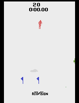 

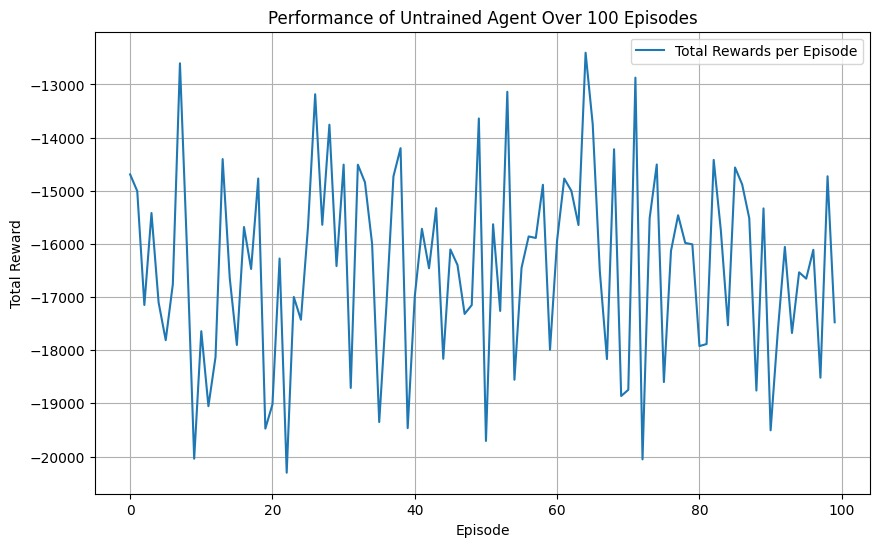

## Training:
We decided to tackle this part of the project with 2 different algorithms:
- DQN
- REINFORCE

## Training - DQN:
This part of the training has 4 sections:
1. Preprocessing: Frames from the environment are converted to grayscale, resized to 84x84, and normalized to the range [-1, 1].
2. DQN architecture: The network uses convolutional layers to extract features, followed by fully connected layers to compute Q-values for each action.
3. Experience Replay Buffer: A replay buffer stores transitions, enabling the agent to learn from past experiences, breaking temporal correlations.
4. Target network: A separate target network stabilizes training by providing fixed Q-value targets that are updated periodically.

### Requirements:
The code requires the following libraries:

- Python 3.8+
- PyTorch
- Gymnasium (with ALE for Atari games)
- OpenCV
- Matplotlib
- NumPy
- Pillow
- WandB for tracking experiments

to install them all, you can use:
`pip install torch gymnasium ale-py shimmy numpy matplotlib opencv-python pillow wandb`

### Preprocessing:
The frames have been preprocessed in the following way:
1. Pass the frame to grayscale
2. Resize to (84, 84)
3. Normalize

This process is the one that has given the best results. 

### Training:
We began training with a purely automated approach in [here](DQN_train.py), but the agent's performance declined quickly. We tried adjusting hyperparameters, such as the epsilon decay, to slow down the exploration-to-exploitation transition. However, in three different configurations:

- Epsilon Decay = 0.9999 with 5000
- Epsilon Decay = 0.995 with 2000 episodes
- Epsilon Decay = 0.995 with 3600 episodes

the agent's rewards consistently dropped as training progressed:

To address this, we manually added played episodes to the replay buffer (as can be seen in [this](DQN_with_manual.py) file). Initially, we set the buffer size to 10, matching the number of manual episodes, but performance remained poor. We suspect the issue was the First-In-First-Out (FIFO) behavior of the replay buffer, which caused transitions to be overwritten too quickly for the agent to learn effectively.

We then increased the buffer size to 30,000 and ran the following tests:

- 1 Manual Episode
- 4 Manual Episodes
- 15 Manual Episodes

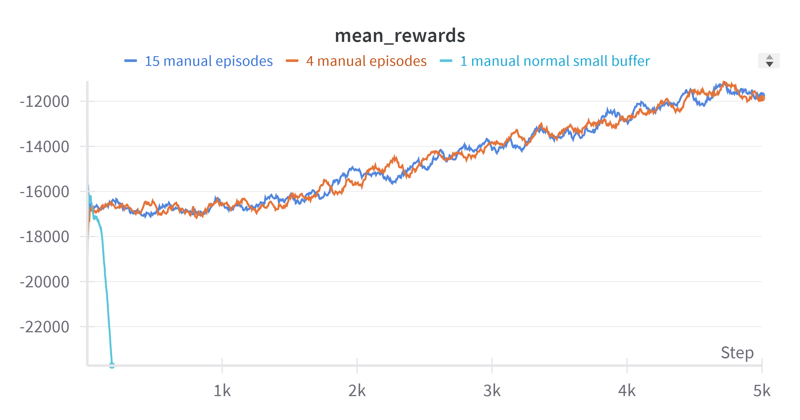

These results improved a lot upon the ones we got when we were experimenting with the epsilon decay. Surprisingly, the results obtained from 4 and 15 manual setups were very similar, with no significant improvement in performance.

We hypothesized that longer training might help, so we increased the maximum number of episodes:
- 10,000 Episodes: Performance dropped almost immediately.
- 6,000 Episodes: Similar results to the above.
- 4,000 Episodes: The performance drop was slower but still present.

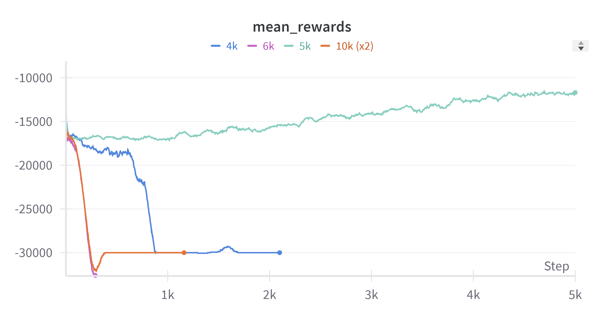

At this point, we're not entirely sure why the agent struggles despite changes in training duration and buffer content.

As a last resort, we thought of training the same DQN architecture with the weights and biases obtained at the end of the execution we did with 5k episodes. However, the results were subpar to say the least. The rewards matched those obtained when training 10k episodes. 
The file where we trained it is [this one](DQN_retrain.py)

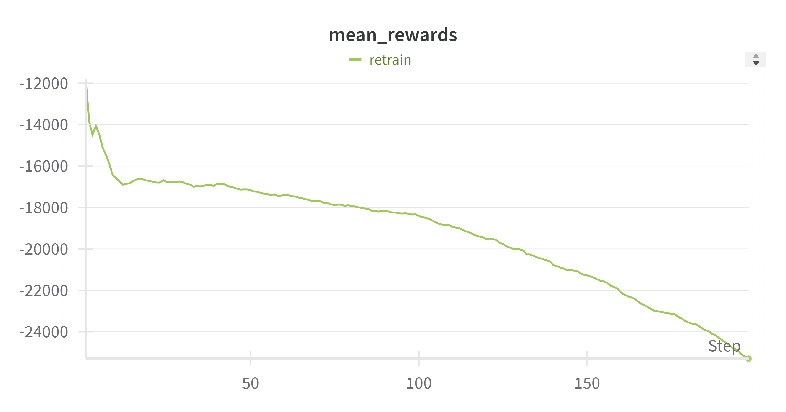

The final model has the following parameters:
- LR = 0.001
- MEMORY_SIZE = 8452*2
- MAX_EPISODES = 4000
- EPSILON = 0.99
- EPSILON_DECAY = 0.999
- GAMMA = 1 #0.99
- BATCH_SIZE = 64
- BURN_IN = 1000
- DNN_UPD = 1
- DNN_SYNC = 2500
- CHANNELS = 1
- WINDOW_SIZE = 80
- NUM_ACTIONS = 3  # Number of actions the agent can take
- INPUT_SHAPE = (CHANNELS, WINDOW_SIZE, WINDOW_SIZE)  # 4 x 80 x 80 # PyTorch uses (channels, height, width) format
- HIDDEN_SIZE = 256

Given that the executions take a long time, it's computationally expensive to fine-tune the parameters or try other DQN architectures. As a consequence, we have decided to work with parameters and architectures that seem to work with most projects even if they might not be the best when working with our environemnt.

Our DQN architecture consists of:

Convolutional Layers:

Three convolutional layers to process image inputs:
- Conv2d(1, 32, kernel_size=8, stride=4) followed by ReLU.
- Conv2d(32, 64, kernel_size=4, stride=2) followed by ReLU.
- Conv2d(64, 64, kernel_size=3, stride=1) followed by ReLU.
These layers extract spatial features from the game's frames.

Fully Connected Layers:

- After flattening the output from the convolutional layers:
- Fully connected layer (Linear) with 256 hidden units followed by ReLU.
- Output layer with units equal to the number of possible actions.

As optimizer, we used Adam with a learning rate of 0.001.
Loss Function: Mean Squared Error (MSE) between predicted Q-values and target Q-values.

The training process is as follows:
First and foremost, we fill the buffer with the manual interactions we have prepared as well as random interactions to ensure we have sufficient data. We alternate between taking actions (with epsilon-greedy exploration) and updating the DQN. The target network is synchronized with the main network every 2000 steps (as indicated in the parameters). Finally, we monitor the performance over the last 100 episodes. 

### Results:
The model used to train is [model_DQN](model_DQN_last_manual.pth)

    

And this is the test plot:

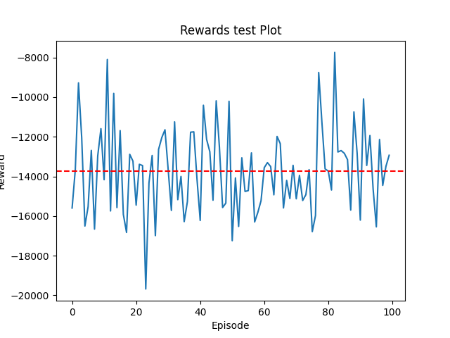

## Training - DDQN:
After training the DQN, we decided to try an extension: DDQN.
We kept the hyperparameters the same and only changed the network. 
The training had a very similar behavior to the basic DQN following the same learning curve. Nevertheless, we did notice an improvement or 200 in the mean rewards of the endind. 

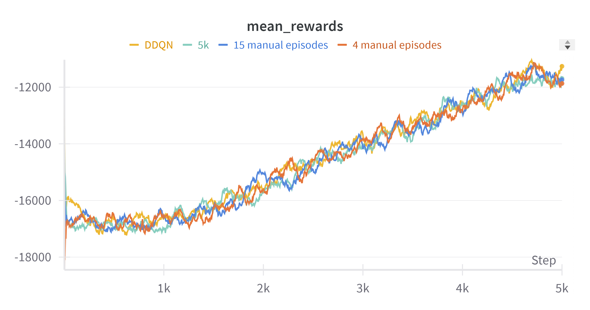

The following photo is a zoomed in picture of the last episodes. 

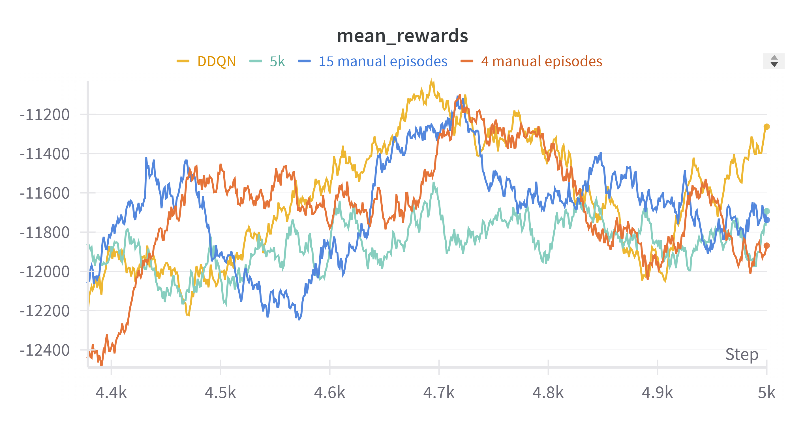

### Results:
Aside from the improvememnt, when testing, the results were pretty similar to the test of the DQN.
The model used to test is [this one](model_DDQN_manual.pth)

     

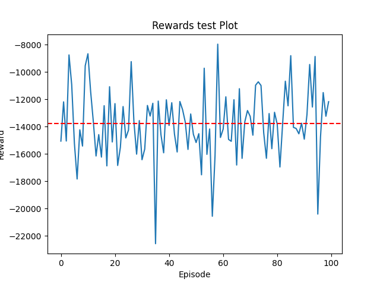

---

---

## Training - REINFORCE:

### Requirements:
To install them all, you can use:
`pip install gymnasium ale-py shimmy numpy matplotlib opencv-python torch torchvision wandb pillow`

### Preprocessing:
The frames have been preprocessed in the following way:
1. Pass the frame to grayscale
2. Resize to (84, 84)
3. Normalize

This process is the one that has given the best results. 

### Training:
Our REINFORCE architecture consists of:
- Convolutional Layers: Extract features from image inputs through three convolutional layers with increasing filters (64, 128, and 64) and ReLU activations.
- Fully Connected Layers: After flattening the convolutional output, two fully connected layers are used. The first maps features to a hidden layer of size 256 (HIDDEN_SIZE), and the second maps to the action space with a softmax activation to produce probabilities for each action.

Hyperparameters:
- Learning rate: 0.0001
- Discount factor (gamma): 0.99
- Hidden size: 256
- Horizon (max steps per episode): 15000
- Maximum trajectories: 5000

As optimizer, we used Adam with a learning rate of 0.0001.
Loss Function: The loss is calculated as the negative log probability of the selected actions weighted by the discounted rewards.

- Collect trajectories by interacting with the environment for up to HORIZON steps or until the episode ends.
- Preprocess frames into grayscale, resized, normalized images.
- Calculate the discounted rewards for the episode using the discount factor.
- Compute the loss as the negative log probability of actions taken, weighted by the discounted rewards.
- Backpropagate the loss and update the policy network using the Adam optimizer.
- Log episode rewards, mean rewards, and loss to Weights & Biases (wandb).
- Save the best model weights based on the highest episode score and mean rewards.
- Optionally save GIFs of the best-performing episodes.

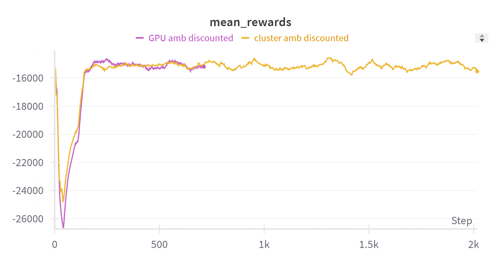

We saw that the agent consistenly got a reward of -9013. After analyzing the episodes, we realized that the agent is finding a trick. It doesn't move. This way, it's straight so it goes at maximum speed and even if it misses flags, the time makes up for it. (py file for the train is [this one](reinforce_train.py))

Additionally, we tried to train it with an ocasional demonstration to guide the training using the manual gameplay we had used in the DQN but the rewards went down quickly. (this expperimentation can be seen in [this python file](reinforce_with_manual.py))

### Results:
The model used to test is [model_reinforce](model_reinforce.pth)

     

And this is the reward:

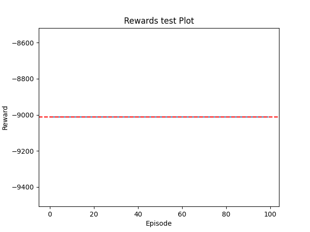

(The mean is the same as all the rewards)

---
---

## Training - A2C:
As a last chance, we tried training a more complex model to see if we could improve our results. 
The A2C performed the training phase in a satisfactory way, however, we soon realized it reached the same point as the reinforce consistently getting, again, rewards of -9013.

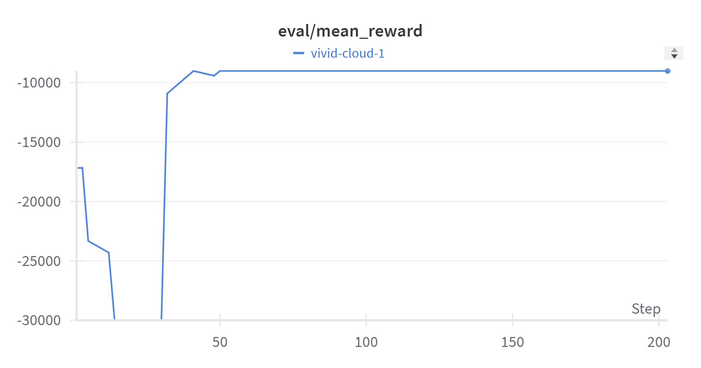

## Conclusion:
Despite various adjustments and manual interventions, achieving stable training in the Skiing-v5 environment was challenging. Incorporating manually played episodes helped marginally but didn’t resolve the performance instability in longer runs. Further investigation into the training dynamics and reward structure might be necessary to identify the root causes.